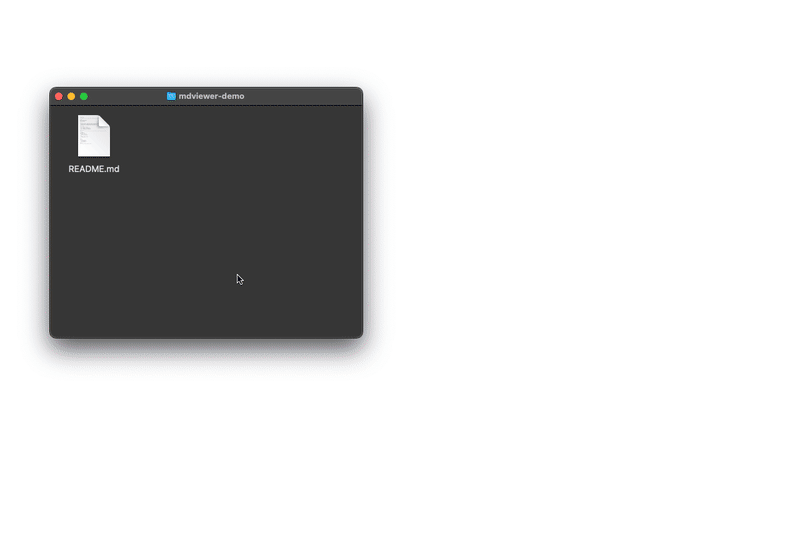
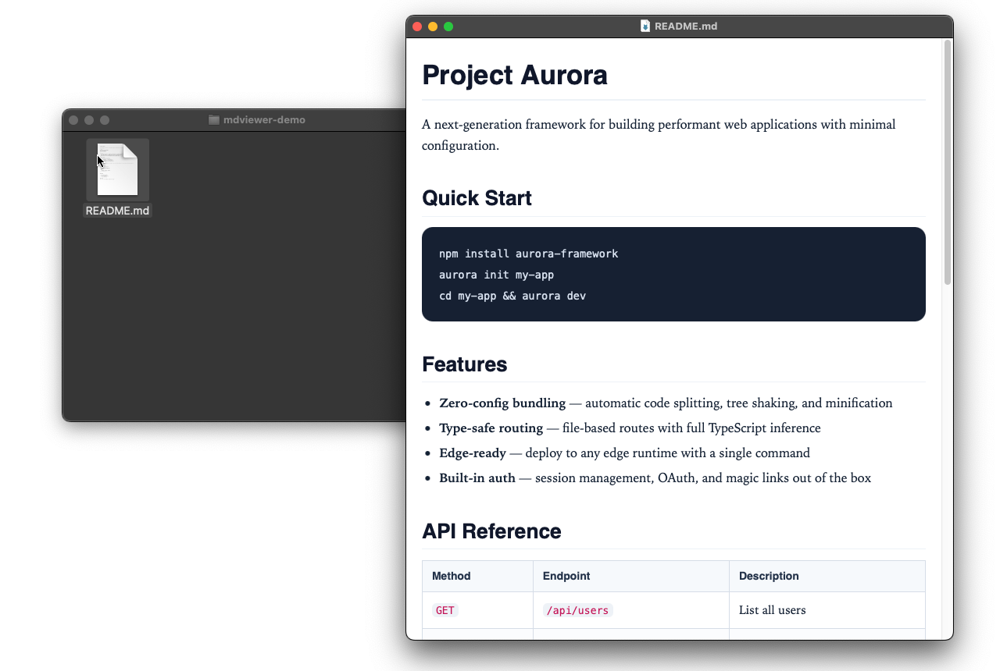
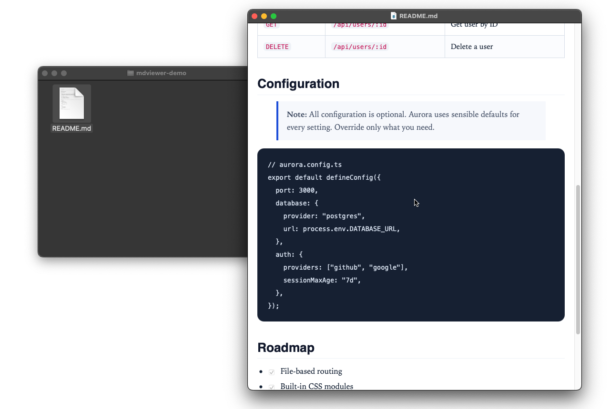

<p align="center">
  
</p>

<h1 align="center">MDviewer</h1>

<p align="center">
  Markdown previews are usually cluttered, browser-based, or tied to editors.<br>
  MDviewer is a tiny native macOS app that opens any Markdown file as a clean, print-ready document.
</p>

<p align="center">
  <a href="https://github.com/JackYoung27/mdviewer/releases/latest">Download</a>
  &nbsp;&middot;&nbsp;
  <a href="#features">Features</a>
  &nbsp;&middot;&nbsp;
  <a href="#install">Install</a>
</p>

---

<p align="center">
  
</p>

## Why MDviewer?

Most Markdown previews are inside editors or browsers.

MDviewer is different:
- Double-click a Markdown file and read it immediately
- Clean typography optimized for printing
- No Electron, no runtime dependencies
- Fully local and secure

## Features

- **Native macOS** — Cocoa + WKWebView; supports Apple Silicon and Intel
- **Print-ready typography** — serif body, clean headings, proper spacing
- **PDF export** — `Cmd+Shift+E` to save, `Cmd+P` to print
- **In-document search** — `Cmd+F` finds text in the rendered Markdown, with next/previous match navigation
- **Live reload** — updates when the file changes on disk; preserves unsaved edits
- **GitHub Flavored Markdown** — tables, task lists, fenced code blocks
- **Mermaid diagrams** — renders fenced `mermaid` diagrams inline, fully local
- **LaTeX math** — renders inline `$...$` and block `$$...$$` math with bundled KaTeX
- **Dark mode** — follows your macOS appearance setting
- **Secure** — HTML sanitized with [DOMPurify](https://github.com/cure53/DOMPurify), strict Content Security Policy
- **Finder integration** — registers as default `.md` handler; opens `.json`/`.yaml`/`.yml` from Open With
- **JSON & YAML viewing** — syntax-colored, alongside Markdown
- **Optional editing** — off by default. Enable **Markdown Viewer → Settings → Click to Edit** in the macOS menu bar. Edit JSON/YAML in the colored view or Markdown in a source view. `Cmd+S` saves, `Esc` discards, and `Cmd+Z` undoes.
- **Tabbed windows** — multiple documents in one window
- **Local-first** — bundled renderers, no accounts or telemetry. Checks GitHub for updates on launch. Remote images load when a document references them.

## Install

Requires **macOS 15.0 (Sequoia) or later**. The download supports Apple Silicon and Intel Macs.

### Download

1. Grab `Markdown-Viewer-macOS.zip` from [Releases](https://github.com/JackYoung27/mdviewer/releases/latest)
2. Unzip, drag to `/Applications`
3. On first launch, macOS will block the app because it's unsigned. To open it:
   - **Right-click** (or Control-click) the app → click **Open** → click **Open** again in the dialog
   - Or run in Terminal: `xattr -cr /Applications/Markdown\ Viewer.app`
4. After the first open, it launches normally like any other app

### Build from source

```bash
git clone https://github.com/JackYoung27/mdviewer.git
cd mdviewer
./build.sh          # builds to dist/Markdown Viewer.app
./install.sh        # optional: copies to /Applications and sets as default handler
```

Requires Xcode Command Line Tools (`xcode-select --install`).

## Settings

To enable editing, select **Markdown Viewer → Settings → Click to Edit** in the macOS menu bar. A checkmark means editing is on. Select it again to turn editing off.

Editing is off by default, so you can select and copy text without entering edit mode. The setting applies to all open documents and is saved across app restarts. It controls Markdown, JSON, and YAML editing.

Turning editing off preserves unsaved text. An open Markdown editor stays open until you save or discard it. For JSON/YAML, turn editing on again to continue an unfinished edit, or press `Esc` to discard it.

## Performance

Files load and save in the background. Find updates highlights without rebuilding the document. Diagram and math libraries load only when needed. Undo stores text changes within a memory limit. Large JSON/YAML files use horizontal scrolling; printed output wraps long lines.

Reloading, changing documents, closing, or quitting prompts before discarding unsaved edits. Saving prompts before replacing a file changed by another app.

## Keyboard Shortcuts

| Action | Shortcut |
|---|---|
| Open file | `Cmd+O` |
| Find in document | `Cmd+F` |
| Next match | `Cmd+G` |
| Previous match | `Cmd+Shift+G` |
| Reload | `Cmd+R` |
| Print | `Cmd+P` |
| Export PDF | `Cmd+Shift+E` |
| Close window | `Cmd+W` |
| Save edit (while editing) | `Cmd+S` |
| Discard edit (while editing) | `Esc` |
| Undo / redo edit | `Cmd+Z` / `Cmd+Shift+Z` |

## Screenshots

| Document view | Code blocks | Checklists |
|---|---|---|
|  |  |  |

## License

[MIT](./LICENSE)
